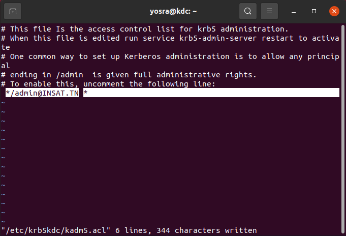

# PostgreSQL Authentication with Kerberos

Enabling GSSAPI / Kerberos authentication in PostgreSQL will allow ***single-sign-on*** – i.e. authentication without using the standard username and password for PostgreSQL clients.

## Steps To Setup Kerberos On UBUNTU

Kerberos is a network *authentication protocol* used to verify the identity of two or more *trusted hosts* across an *untrusted network*. It uses *secret-key cryptography* and a *trusted third party* (Kerberos Key Distribution Center) for authenticating client-server applications. Key Distribution Cente (KDC) gives clients tickets representing their network credentials. The Kerberos ticket is presented to the servers after the connection has been established.


*!! Since Kerberos protocol has a timestamp involved, all three machines clocks need to be synchronized.*

### Hostname and IP Addresses

We will need three machines. In my case I'm using three ***ubuntu*** machines : my physical machine and two virtual machines inside of VirtualBox. My physical machine will be the client and the two other machines will be the Service Server and the KDC.

Virtual machines have a NAT adapter by default but in order to **assign IP addresses** to these machines we will need to add a **host-only adapter** manually.

Let's start by creating a new virtual machine.
Under *File* go to *Host Network Manager ...* and then click *Create*.


And don't forget to enable the *DHCP Server*.


Now it's time to connect these virtual machines to our new virtual network.
Go to the *Settings* of each of the virtual machines and under *Network* enable a second adapter :


Specify the type of the adapter (*host-only adapater*) and the virtual network to connect to (the one we just created).


We can check the IP addresses of all three machines by running `hostname -I` in each one.

In my case :

* Client machine(physical machine) ip address is **192.168.56.1**
* Service server machine (one the virtual machines) ip address is **192.168.56.108**
* KDC machine (the other virtual machine) ip address is **192.168.56.102**


Now that we added ip addresses to the virtual machines, we will start by setting hostnames for each machine :

* KDC machine       
      `hostnamectl --static set-hostname kdc.insat.tn`

  
* Service Server machine        
      `hostnamectl --static set-hostname pg.insat.tn`

  
* Client machine      
      `hostnamectl --static set-hostname client.insat.tn`


And *open a new terminal for changes to take effect.*

*We can check the hostname of a machine by running the command : `hostname`*

Next, we will be mapping these hostnames to their corresponding IP addresses on all three machines using */etc/hosts* file. <br> 
  `sudo vi /etc/hosts`
  
Now, we should set below information to */etc/hosts* **for all three machines** :

    <KDC_IP_ADDRESS>    kdc.insat.tn       kdc
    <PG_SERVER_ADDRESS>    pg.insat.tn        pg
    <CLIENT_ADDRESS>    client.insat.tn    client


Once the setup is done, we can check if everything is working fine by using the `nslookup` command to **query the DNS** to obtain the mapping we just did and the `ping` command to ensure that all three machines are reachable.

This an example in the client machine :


### Key Distribution Center Machine Configuration

Following are the packages that need to installed on the KDC machine : <br>
 ```
    $ sudo apt-get update
    $ sudo apt-get install krb5-kdc krb5-admin-server krb5-config
 ```
 
During the installation, we will be asked for configuration of :

 * the realm : 'INSAT.TN' (must be *all uppercase*)


 * the Kerberos server : 'kdc.insat.tn'


 * the administrative server : 'kdc.insat.tn'

 
***Realm** is a logical network, similar to a domain, that all the users and servers sharing the same Kerberos database belong to.* 

The master key for this KDC database needs to be set once the installation is complete :
   
```
sudo krb5_newrealm
```


*The users and services in a realm are defined as a **principal** in Kerberos.* These principals are managed by an *admin user* that we need to create manually :

```
    $ sudo kadmin.local
    kadmin.local:  add_principal root/admin
```


[kadmin.local](https://web.mit.edu/kerberos/krb5-1.12/doc/admin/admin_commands/kadmin_local.html) is a KDC database administration program. We used this tool to create a new principal in the INSAT.TN realm (`add_principal`).

We can check if the user *root/admin* was successfully created by running the command : `kadmin.local: list_principals`. We should see the 'root/admin@INSAT.TN' principal listed along with other default principals.


Next, we need to grant all access rights to the Kerberos database to admin principal *root/admin* using the configuration file */etc/krb5kdc/kadm5.acl* . <br>
 `sudo vi /etc/krb5kdc/kadm5.acl`

In this file, we need to add the following line :

    */admin@INSAT.TN    *



For changes to take effect, we need to restart the following service : `sudo service krb5-admin-server restart`

Once the admin user who manages principals is created, we need to create the principals. We will to create principals for both the client machine and the service server machine.

**Create a principal for the client**

```
    $ sudo kadmin.local
    kadmin.local:  add_principal yosra
```


**Create a principal for the service server**

```    
         kadmin.local:  add_principal postgres/pg.insat.tn
```


    

*We can check the list of principals by running the command : `kadmin.local: list_principals`* <br>


### Service server Machine Configuration

For an easier configuration of Postgres I changed the Operating System login name from 'yosra' to 'postgres'.

#### Configuration of Kerberos

##### Installation of Packages  

Following are the packages that need to be installed on the Service server machine : <br>

```
$ sudo apt-get update
$ sudo apt-get install krb5-user libpam-krb5 libpam-ccreds
```
 
During the installation, we will be asked for the configuration of :
 * the realm : 'INSAT.TN' (must be *all uppercase*)
 * the Kerberos server : 'kdc.insat.tn'
 * the administrative server : 'kdc.insat.tn'

PS : *We need to enter the same information used for KDC Server.*

##### Preparation of the *keytab file*

We need to extract the service principal from KDC principal database to a keytab file.

1. In the KDC machine run the following command to generate the keytab file in the current folder :

```
   $ ktutil 
   ktutil:  add_entry -password -p postgres/pg.insat.tn@INSAT.TN -k 1 -e aes256-cts-hmac-sha1-96
   Password for postgres/pg.insat.tn@INSAT.TN: 
   ktutil:  wkt postgres.keytab
```


2. Send the keytab file from the KDC machine to the Service server machine :

In the Postgres server machine make the following directories :
   
   `mkdir -p /home/postgres/pgsql/data`

In the KDC machine send the keytab file to the Postgres server :

   `scp postgres.keytab postgres@<PG_SERVER_IP_ADDRESS>:/home/postgres/pgsql/data`

! We need to have **openssh-server** package installed on the service server : `sudo apt-get install openssh-server`.
   


3. Verify that the service principal was succesfully extracted from the KDC database :

    1. List the current keylist 

        `ktutil:  list`

    2. Read a krb5 keytab into the current keylist

        `ktutil:  read_kt pgsql/data/postgres.keytab`

    3. List the current keylist again

        `ktutil:  list`


#### Configuration of the service (PostgreSQL)

##### Installation of PostgreSQL 

1. Update the package lists 
 
   `sudo apt-get update`
 
2. Install necessary packages for Postgres

   `sudo apt-get install postgresql postgresql-contrib`

3. Ensure that the service is started

   `sudo systemctl start postgresql`


##### Create a Postgres Role for the Client 

We will need to :

* create a new role for the client
    
    `create user yosra with encrypted password 'some_password';`

* create a new database

    `create database yosra;`

* grant all privileges on this database to the new role

    `grant all privileges on database yosra to yosra;`


To ensure the role was successfully created run the following command :

```
postgres=# SELECT usename FROM pg_user WHERE usename LIKE 'yosra';
```


The client yosra has now a role in Postgres and can access its database 'yosra'.


##### Update Postgres Configuration files (*postgresql.conf* and *pg_hba.conf* )

* Updating *postgresql.conf*

To edit the file run the following command :

`sudo vi /etc/postgresql/12/main/postgresql.conf`

By default, Postgres Server only allows connections from localhost. Since the client will connect to the Postgres server remotely, we will need to modify *postgresql.conf* so that Postgres Server allows connection from the network :

```
listen_addresses = '*'
```

 We will also need to specify the keytab file location :
 ```
 krb_server_keyfile = '/home/postgres/pgsql/data/postgres.keytab'
 ```


* Updating *pg_hba.conf*

HBA stands for host-based authentication. *pg_hba.conf* is the file used to control clients authentication in PostgreSQL. It is basically a set of records. Each record specifies a **connection type**, a **client IP address range**, a **database name**, a **user name**, and the **authentication method** to be used for connections matching these parameters.

The first field of each record specifies the **type of the connection attempt** made. It can take the following values :

* `local` : Connection attempts using *Unix-domain sockets* will be matched. 
* `host` : Connection attempts using *TCP/IP* will be matched (SSL or non-SSL as well as GSSAPI encrypted or non-GSSAPI encrypted connection attempts).
* `hostgssenc` : Connection attempts using *TCP/IP* will be matched, but only when the connection is made with GSSAPI encryption.

This field can take other values that we won't use in this setup. For futher information you can visit the official [documentation](https://www.postgresql.org/docs/current/auth-pg-hba-conf.html).

Some of the possible choices for the **authentication method** field are the following :

* `trust` : Allow the connection unconditionally. 
* `reject` : Reject the connection unconditionally. 
* `md5` : Perform SCRAM-SHA-256 or MD5 authentication to verify the user's password.
* `gss` : Use GSSAPI to authenticate the user. 
* `peer` : Obtain the client's operating system user name from the operating system and check if it matches the requested database user name. This is only available for *local connections*.

So to allow the user 'yosra' to connect remotely using  Kerberos we will add the following line :

```
# IPv4 local connections:
hostgssenc   yosra     yosra           <IP_ADDRESS_RANGE>         gss include_realm=0 krb_realm=INSAT.TN
```

And comment other connections over TCP/IP.

`krb_realm=INSAT.TN` : Only users of INSAT.Tn realm will be accepted.

`include_realm=0` : If [include_realm](https://www.postgresql.org/docs/current/gssapi-auth.html) is set to 0, the realm name from the authenticated user principal is stripped off before being passed through the user name mapping. In a multi-realm environments this may not be secure unless krb_realm is also used. 


For changes to take effect we need to restart the service :   `sudo systemctl restart postgresql`.


### Client Machine Configuration

Following are the packages that need to be installed on the Client machine : <br>

```
$ sudo apt-get update
$ sudo apt-get install krb5-user libpam-krb5 libpam-ccreds
```
 
During the installation, we will be asked for configuration of :
 * the realm : 'INSAT.TN' (must be *all uppercase*)
 * the Kerberos server : 'kdc.insat.tn'
 * the administrative server : 'kdc.insat.tn'


PS : *We need to enter the same information used for KDC Server.*


## User Authentication

Once the setup is complete, it's time for the client to authenticate using kerberos.

First, try to connect to PostgreSQL remotely :

`$ psql -d yosra -h pg.insat.tn -U yosra`


*-d* specifies the database, *-U* specifies the postgres role and *-h* specifies the ip address of the machine hosting postgres.

In the client machine check the cached credentials :

`$ klist`

Then initial the user authentication :

`$ kinit yosra`

And check the ticket granting ticket (TGT) :

`$ klist`


Now try to connect once again :


Now you can check the service ticket :
`$ klist`


[Useful video tutorial](https://www.youtube.com/watch?v=vx2vIA2Ym14)
